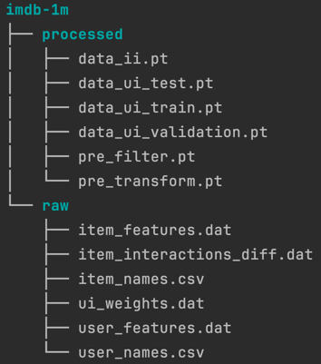

### Data splitting

In this section, our aim is to divide the dataset into three parts: **_training_**, **_testing_**, and **_validation_**.
The training dataset is for teaching the model, the testing dataset is for assessing its performance on new data,
and the validation dataset is for fine-tuning and optimizing the model during training.
Separating these datasets helps ensure that the model is robust, generalizes well, and does not overfit to the training data. 

As an example, below are the steps used to divide the imdb-1m dataset into training, testing, and validation:

- Step 1: item-item dataset
> A graph dataset named data_ii containing the features below is created: 
> data_ii = Data(x=[3848, 31], edge_index=[2, 4455450], edge_attr=[4455450])
> - x: item features
> - edge_index: edges
> - edge_attr: weights of edges

- Step 2: user-item dataset
> Three graph dataset named **_data_ui_train_**, **_data_ui_test_**, and **_data_ui_validation_** containing the features below are created:
> - data_ui_train = Data(x=[9888, 31], edge_index=[2, 1594986], edge_attr=[1594986]) 
> - data_ui_test = Data(x=[9888, 31], edge_index=[2, 199374], edge_attr=[199374]) 
> - data_ui_validation = Data(x=[9888, 31], edge_index=[2, 199374], edge_attr=[199374]) 

- Step 3: matrix visualization
- 

- Files tree 
The prepared matrices can be downloaded using bellow link:

> - [imdb-1m-splitted](https://drive.google.com/file/d/1ZzaHJYxCo9gdAgVjpva6WbR2yeS0YzSm/view?usp=sharing)

