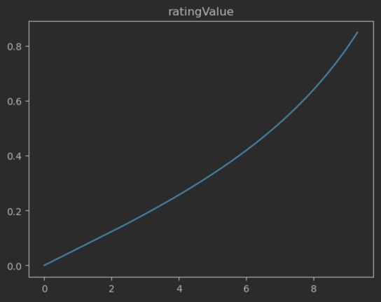
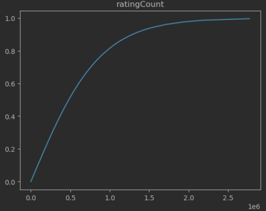
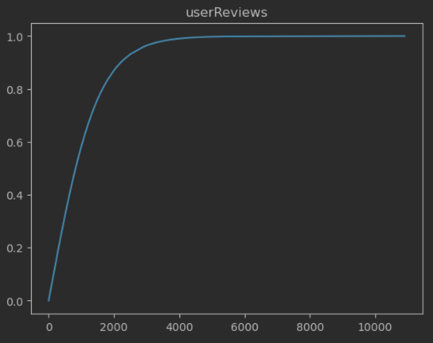
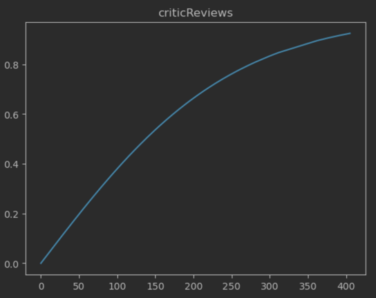
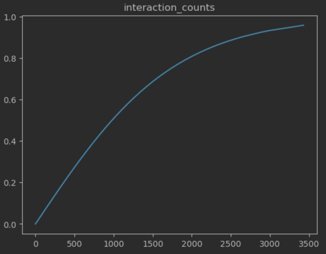
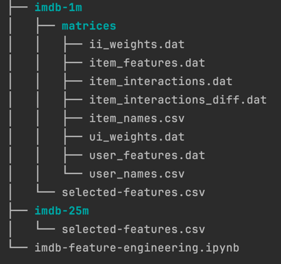

### Feature engineering

- Step 1: Select desired features
> Firstly, we select features that seem to have the most impact on items.
> For example, for the imdb dataset we choose the following features:
> - imdbId
> - type
> - ratingCount
> - ratingValue
> - genre
> - userReviews
> - criticReviews

- Step 2: Clean, scale, and visualize features
> Here, we scale all features to be between zero and one (`selected-features.csv`).
> For this, we select boundaries and scale them to have specific distributions for our dataset.
> For example, for the imdb dataset we choose bellow distributions: 

 

 

- Step 3: Create desired matrices
> Based on the data gathered thus far, we create the necessary matrices for use in both graph creation and graph processing.
> For example, for the imdb dataset, we create the following matrices (the order is important in these matrices):
> - `item_names.csv`: name of items
> - `item_interactions.dat`: number of user-item interactions
> - `item_interactions_diff.dat`: the difference between each pair of user-item interactions
> - `item_features.dat`: item features and their values
> - `ii_weights.dat`: the weight between every pair of items
> - `user_names.csv`: name of users
> - `user_features.dat`: user features and their values
> - `ui_weights.dat`: the weight between every user-item pair

### Files tree
The prepared matrices can be downloaded using bellow link:

> - [imdb-1m-matrices.zip](https://drive.google.com/file/d/1lZZB9kfmB0oTFBjxugoFAEfBvnIG-vGM/view?usp=drive_link)

