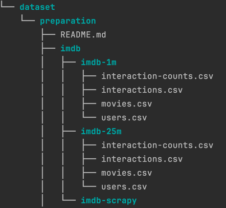
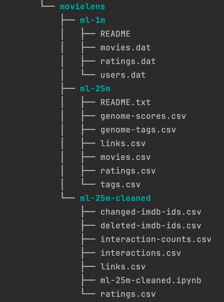

### Dataset preparation

- Step 1: Download the ml-25m dataset
> Firstly, we download the ml-25m.zip dataset, which includes data gathered by [GroupLens](https://grouplens.org/datasets/movielens/) from the [MovieLens](https://movielens.org/) website. The dataset comprises 25 million ratings and one million tag applications applied to 62,000 movies by 162,000 users. Includes tag genome data with 15 million relevance scores across 1,129 tags. (Released 12/2019)

- Step 2: Clean the ml-25m dataset
> We aim to clean the existing data in ml-25m to create our desired IMDb dataset.
> 1. Identify the deleted and changed imdb ids listed in the ml-25m dataset (`deleted-imdb-ids.csv` & `changed-imdb-ids.csv`)
> 2. Clean `links.csv` and `ratings.csv`
> 3. Find the user-movie interactions (`interactions.csv`)
> 4. Count the user-movie interactions (`interaction-counts.csv`)

- Step 3: Crawl the IMDb website
> To collect additional data for each movie from the IMDb website, we need to crawl the site and retrieve more details. 
> After running the `run.sh` script, the result will be stored in the movies.csv file.
> Below are the details for each movie gathered from IMDb:
> - imdbId 
> - type,name
> - ratingCount
> - bestRating
> - worstRating
> - ratingValue
> - contentRating
> - genre
> - datePublished
> - keywords
> - actor
> - director
> - creator
> - duration
> - popularity
> - userReviews
> - criticReviews
> - metaScore

- Step 4: Collect the imdb-25m & imdb-1m datasets
> Building upon prior preparations, we gather data and create our imdb datasets.
> The imdb dataset contains three files:
> 1. `interaction-counts.csv`: The number of user interactions with each movie
> 2. `interactions.csv`: interactions of each user with each movie along with their respective weights
> 3. `movies.csv`: full details for all movies
> 4. `users.csv`: full details for all users

### Files tree
The prepared data can be downloaded using bellow links:

> - [imdb-1m.zip](https://drive.google.com/file/d/16s_ICcb2RAHD_tXtlsIQyrlh8WGNnrHt/view?usp=drive_link)
> - [imdb-25m.zip](https://drive.google.com/file/d/1nasqcDolc9O_4MfXQN-aB3EJqHGM75Nm/view?usp=drive_link)
> - [ml-1m.zip](https://files.grouplens.org/datasets/movielens/ml-1m.zip)
> - [ml-25m.zip](https://files.grouplens.org/datasets/movielens/ml-25m.zip)
> - [ml-25m-cleaned.zip](https://drive.google.com/file/d/1jMgdgwsGW5jAcLRWb5y2zDthmPWdIFzh/view?usp=drive_link)

 
